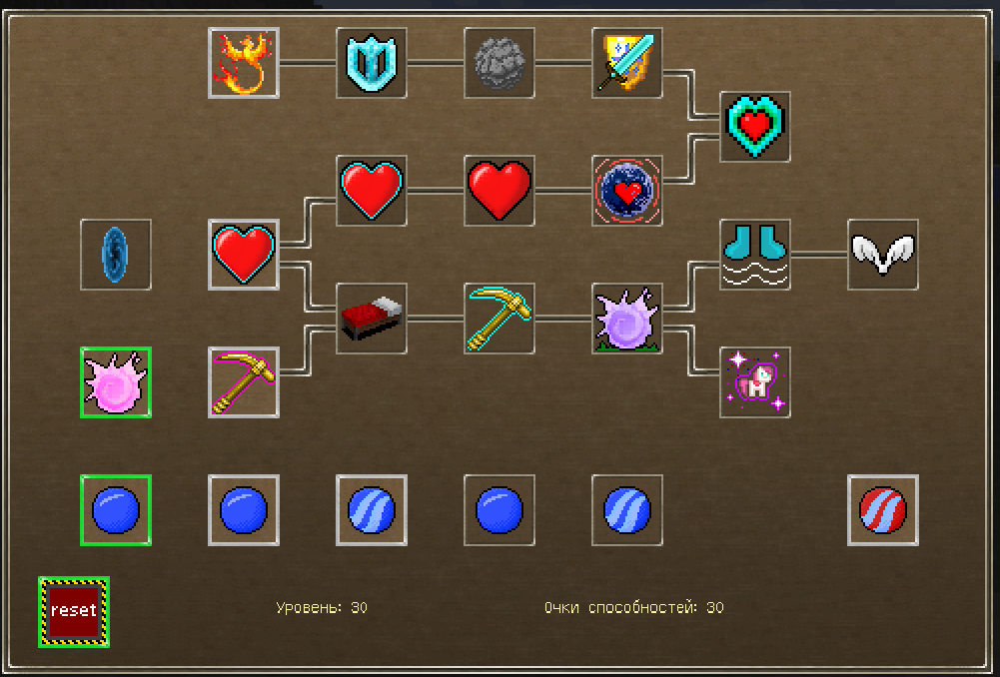
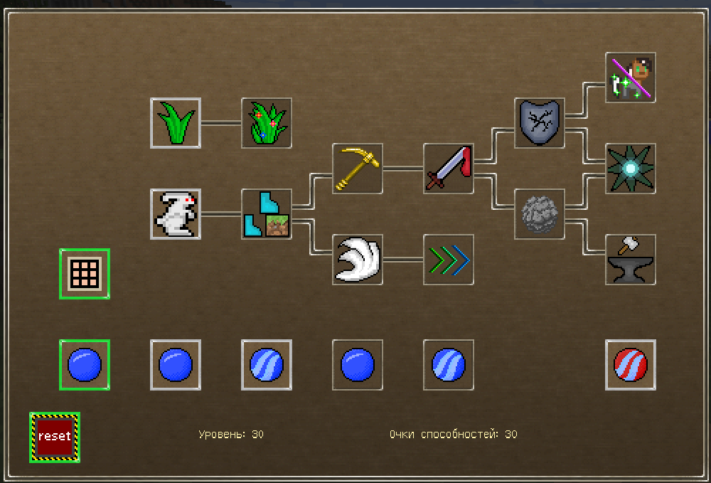
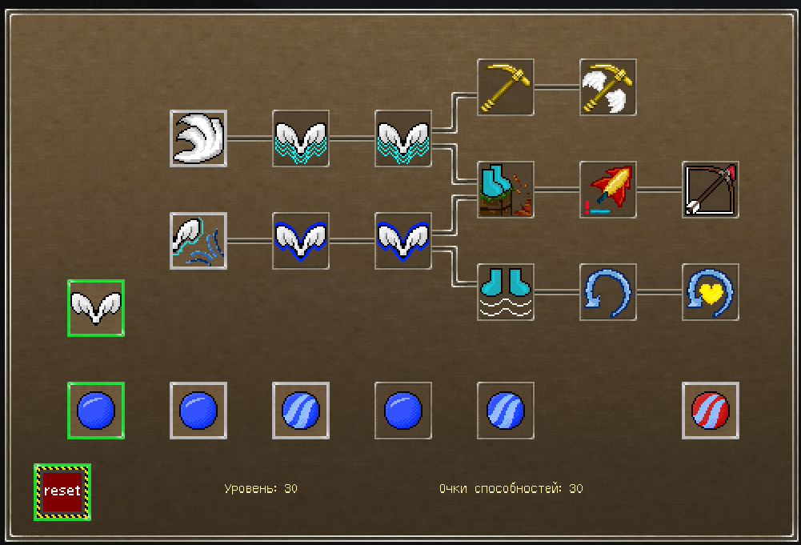

# [Pony Magic 3.0](https://www.curseforge.com/minecraft/mc-mods/pony-magic/files)

Pony Magic - это модификация для Minecraft 1.12.2, которая добавляет возможность использовать различную магию. Создавался для использования в сборке с [Mine Little Pony](https://github.com/MineLittlePony/MineLittlePony)  
Мод добавляет четыре "расы" пони, систему энергии (маны) и 40+ способностей. 

### Установка:
- установить [Minecraft forge 1.12.2](https://files.minecraftforge.net/net/minecraftforge/forge/index_1.12.2.html)
- скачать [Potion Core 1.8](https://www.curseforge.com/minecraft/mc-mods/potion-core/files/2736248) и скопировать в папку `mods/`
- скачать [Pony Magic](https://www.curseforge.com/minecraft/mc-mods/pony-magic/files) и скопировать в `mods/`  

### Настройка:  
Большинство элементов мода можно настроить с помощью конфиг-файлов в папке `config/ponymagic/`  

### Использование:  
Для начала нужно определиться с расой (у каждой уникальные способности).  
- Единороги (`unicorn`) - могут телепортироваться, исцелять себя и союзников, купаться в лаве и управлять зачарованиями предметов
- Земнопони (`earthpony`) - устойчивы в бою, могут ускорять рост растений и чинить экипировку 
- Зебры (`zebra`) - могут управлять эффектами зелий
- Пегасы (`pegasus`) - могут летать  

Затем, выдать расу командой: `/magic race <playername> <racename>`  
После этого игроку открывается доступ к веткам прокачки способностей расы (кнопка `O`) и к квестам (кнопка `P`).

##### Квесты  
  

Для того, чтобы иметь возможность изучить какую-нибудь способность, - нужно проходить квесты.  
Прохождение квестов награждает очком способностей, которое можно потратить на изучение того или иного навыка в меню способностей.    

##### Обнуление способностей  
Для сброса способностей нужен предмет "Книга обнуления" или 30 уровней ванильного опыта.   

##### Выносливость / энергия / стамина / мана / синяя полоска
  

Изначально все расы имеют 100 единиц стамины.  
Восстановление происходит, если игрок сыт и стоит на блоке. Так же, есть слабая регенерация, если игрок плавает в воде.  
Максимальное количество и скорость регенерации можно увеличить с помощью соответствующих способностей.  
Выносливость израсходуется на использование активных способностей и при полёте у пегасов.  
Есть некоторые особые скиллы, которые тратят выносливость при определённых действиях или вообще её не требуют.  
##### Способности / скиллы / умения  
  

Чтобы получить доступ к скиллу его нужно изучить за очки способностей.  
Способности делятся на два типа: активные и пассивные.  
Активные используются с помощью команды `/cast <spellname>`  
Пассивные активируются сами или действуют постоянно.  
Некоторые способности можно выключать (абсолютный щит).  
Краткое описание скилла есть в подсказке в окне способностей.  
Так же, есть расовая способность, которую не нужно изучать.  
Начальные расовые способности единорогов и земнопони зависят от сборки сервера.  

#### Команды:  
Изменение расы:  
`/magic race <username> <race>`  
Тестирование расы (максимальный уровень):  
`/magic test <race>`  
Использование способности:  
`/cast <skillname>`  
Прокачка скилла:  
`/magic spell <username> <spellname>`  
Изменение уровня:  
`/magic setlevel <username> <level>`  
Изменение количества доступных очков способностей:  
`/magic setpoints <username> <points>`  
Проверка количества энергии:  
`/stamina check [username]`  
Убрать всю энергию:  
`/stamina zero|empty [username]`  
Восстановить всю энергию:  
`/stamina fill|restore [username]`  
Добавить определённое количество:  
`/stamina add [username] <amount>`  
Изменить на определённое количество:  
`/stamina set [username] <amount>`  
Установить уровень максимальной энергии:  
`/stamina setmax [username] <amount>`

### Скриншоты:  
Способности единорогов:  
  

Способности земнопони:  
  

Способности пегасов:  

  
Способности зебр:  

### Большое спасибо этим пони:
- Akell - за организацию разработки; придумывание алгоритмов и способностей; рисование текстур; тестирование
- Orhideous - за помощь с дебагом и рефакторингом кода
- Polyacov_Yury - за помощь с дебагом и рефакторингом кода
- Jerry - за идеи способностей; рисование текстур; тестирование
- KostaRMax - за рисование текстур и тестирование
- Queen_Stan - за рисование текстур и тестирование
- Zloba - за рисование текстур
- Kwaarr - за идеи способностей и тестировние
- XenoOxotnik - за идеи способностей и тестировние
- Tol_Eres - за идеи способностей и тестировние
- Holllow - за идеи способностей и тестировние
- Wecanfly - за идеи способностей и тестировние
- Walking_Trouble - за идеи способностей и тестировние
- Jorest - за тестировние
- niroy - за идеи способностей
- Lavenda - за идеи способностей
- afflixia - за английский перевод
- ACGaming - за немецкий перевод

### Сборка мода
- `./gradlew setupDecompWorkspace`
- `./gradlew reobfJar`  

Файл артефакта в `build/libs/`

### Лицензия
[GNU LGPLv3](LICENSE.txt)